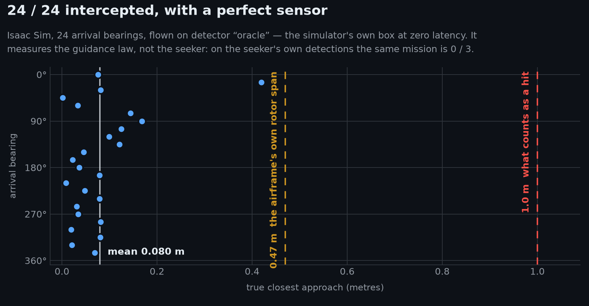
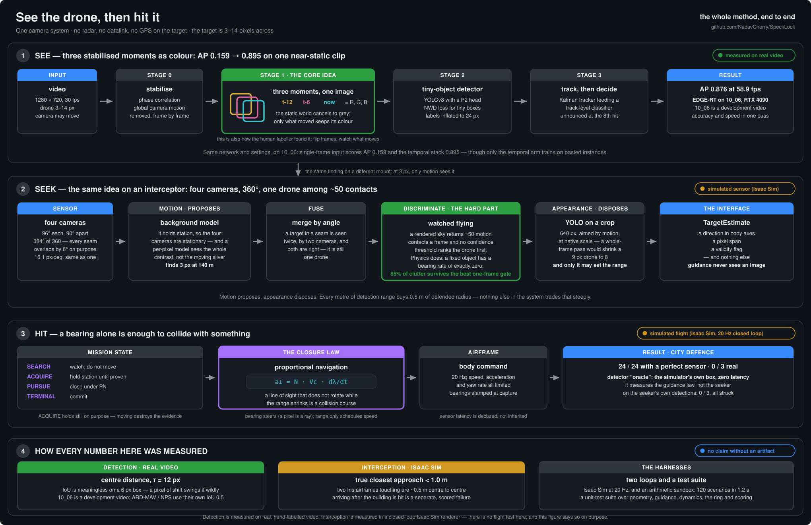

# SpeckLock

### Finding a drone that is three pixels wide, and then flying into it.

A drone at 3–14 px in 720p, seen from a **moving** camera, is invisible to a single-frame
detector — and to a human. This repository is the record of one idea for fixing that, and of
everything measured while testing whether the idea holds.

[](https://nadavcherry.github.io/SpeckLock/)
[](LICENSE)
[](https://github.com/NadavCherry/SpeckLock/actions/workflows/tests.yml)

**[Project site](https://nadavcherry.github.io/SpeckLock/)** ·
**[Video gallery](https://nadavcherry.github.io/SpeckLock/gallery.html)** ·
**[The method in one diagram](docs/media/architecture_system.svg)** ·
[Docs](docs/) · [Licence](LICENSE)

---

## 1 · How to read the claims in this file

Every claim carries one of three marks. Nothing here is stated without one.

| mark | means |
|---|---|
| 🟢 **demonstrated** | measured on real hand-labelled video, by the evaluator in this repo, on data named in the row |
| 🟡 **simulation** | measured closed-loop in NVIDIA Isaac Sim. **There is no flight test in this project** |
| ⚠️ **limitation** | a known weakness, an unreproduced figure, or a claim the evidence does not support |

Two conventions the numbers depend on:

* **Matching depends on the data.** On this project's own videos it is by centre distance
  (τ = 12 px): a 1–2 px shift zeroes IoU on a 6 px box, so there IoU would measure annotation
  jitter rather than detection. On **ARD-MAV and NPS** (§4–§6) it is **IoU ≥ 0.5**, each
  benchmark's own protocol — the same kind of number the papers report. A centre-distance number
  and an IoU number are never subtracted; [`dronedet/metrics.py`](dronedet/metrics.py) refuses the
  subtraction in code.
* **Significance means two tests agreeing.** A paired bootstrap **and** a permutation test over
  sequences, seed-matched. One test alone will call a small-N difference significant; requiring
  both makes a thin result *inconclusive* rather than manufacturing confidence. The results
  summary and the size curve also **Holm-correct across each table**, so the best of many
  comparisons is not reported as a finding.

---

## 2 · The idea

Stabilise the video, then stack three grayscale moments — **t−12, t−6, t** — as the R, G and B
channels of one image. The static world cancels to grey. Anything that moved leaves a coloured
trail.

<p align="center">
  
  <br/>
  <em><b>Left:</b> find the drone. You mostly can't, and neither can a single-frame detector — the
  controlled one in §3 scores AP 0.159. <b>Right:</b> the detector's actual input. <b>Yellow</b> = 12 frames ago,
  <b>magenta</b> = 6 ago, <b>cyan</b> (circled) = now. The trail even shows its direction of
  flight.</em>
</p>

The network is an ordinary YOLOv8s with a stride-4 P2 head. **The representation is the
contribution, not the architecture.**

---

## 3 · The main result: what the representation is worth

🟢 **demonstrated.** One controlled comparison, on `10_06.mp4`, scored by this repo's evaluator:

| input representation | AP | 95% CI | recall† | precision† |
|---|---|---|---|---|
| single frame, RGB | **0.159** | [0.030, 0.366] | 0.199 | 0.337 |
| **3-moment temporal stack** | **0.895** | [0.776, 0.976] | 0.840 | 0.946 |

† at the best-F1 threshold swept on this same video — an oracle operating point, which
`dronedet/metrics.py` says in writing is not an achievable one. AP is threshold-free.

**Same network, same hyperparameters and seed, same 1280 px, same pipeline, same video** — the two
checkpoints decode to identical training arguments apart from the dataset path. **One confound
remains, and it is not small:** only the temporal arm's training set carries pasted drone and bird
instances (`realtime/tools/make_datasets_rt.py` applies copy-paste only `if temporal:`), and
[`realtime/README.md`](realtime/README.md) credits that augmentation with a large share of the
temporal arm's gain. So this gap is the representation *together with* that augmentation. A
single-frame arm trained on the same pastes was runnable and has not been run.

> ⚠️ An earlier version of this table compared an off-the-shelf detector at 1760 px against this
> pipeline at 1280 — different architecture, different training corpus **and** different
> resolution — under a heading about "input representation". The controlled pair above replaces
> it. The uncontrolled comparison is still run, and still labelled as uncontrolled, in
> [`work/ablation/REPORT.md`](work/ablation/REPORT.md).

The same effect appears at the smallest sizes on our own 8 px task, where the single-frame control
scores **0.032** against the temporal stack's **0.430** — a 13× gap on the same network and recipe,
and here **neither arm trains on pasted instances**, so this is the pair without the copy-paste
confound. It is one flight and three seeds: a strong direction, not a tested effect.

---

## 4 · Accuracy against target size

🟢 **demonstrated.** ARD-MAV's official 15-video test split, 3 seeds per arm, ~28,000 instances,
one evaluator. Bins on √area in pixels.

| bin | n | ours | YOLOMG | ours, single-frame |
|---|---|---|---|---|
| **<8 px** | 5677 | **0.503** ± 0.011 | 0.420 ± 0.017 | 0.378 ± 0.031 |
| **8–10 px** | 5055 | **0.602** ± 0.007 | 0.507 ± 0.015 | 0.493 ± 0.029 |
| 10–16 px | 7529 | 0.732 ± 0.013 | **0.787** ± 0.010 | 0.728 ± 0.033 |
| 16–25 px | 4731 | 0.729 ± 0.029 | **0.888** ± 0.006 | 0.758 ± 0.039 |
| >25 px | 5168 | 0.739 ± 0.023 | **0.905** ± 0.018 | 0.771 ± 0.054 |

The means cross at about **10 px**, and the direction is consistent across all three seeds on both
sides. But see [§6](#6--what-is-not-established): **only the competitor's side of that crossover is
statistically significant.**

Full analysis, both bin sets, and the paired tests: [size curve](docs/reports/size-crossover.md).

---

## 5 · Against the state of the art

🟢 **demonstrated.** The competitor is **YOLOMG** ([arXiv:2503.07115](https://arxiv.org/abs/2503.07115)),
**trained by us** from its own code on its own published recipe — 100 epochs at 1280 px against our
30 at 640, roughly twice our gradient steps — then scored on our splits by our evaluator. That makes
it a *paired* measurement rather than a published scalar taken on trust.

| benchmark | ours | YOLOMG | who leads |
|---|---|---|---|
| ARD-MAV, official 15-video split | 0.809 | **0.834** | **them** |
| NPS-Drones, video-disjoint test | 0.487 | **0.527** | **them** |
| our own 8 px task (fine-tuned) | **0.840** | 0.604 | us |

**They lead on both public benchmarks — on point estimates.** Under the paired test, Holm-corrected
across the table, that overall lead is significant on no seed of either benchmark; what does reach
significance is their advantage on large targets (§4, §6). That is the honest headline of this
comparison, and it is stated first for that reason.

What survives alongside it: below 10 px the ordering reverses (§4), and on the 8 px task — where
every target is smaller than any bin ARD-MAV can populate — we lead in every populated bin on the
mean of three seeds. It is one flight, so no paired test applies, and at <8 px (123 instances)
YOLOMG's best seed beats all three of ours.

> Published numbers are IoU ≥ 0.5 on each paper's own split. Ours on ARD-MAV and NPS are IoU ≥ 0.5
> too — but NPS is scored on a video-disjoint split rather than the published one, and which
> videos are held out is the largest single term in the accounting below. Read this as a
> **class** comparison, not a leaderboard entry.

### Why the published NPS number is 0.95 and ours is 0.527

🟢 **demonstrated.** This looked like a two-fold discrepancy and turned out to be three mechanisms,
each measured with their code and their metric:

| step | worth |
|---|---|
| video-disjoint **test** (clips 41–50) | **0.505** |
| → video-disjoint **val** (clips 37–40): *which videos you hold out* | **+0.291** |
| → per-frame split: *leakage* | **+0.045** (a lower bound) |
| → AP convention, frame set, aggregation | **+0.010** |
| **still unexplained** | **~0.109** |

**About 78 % is accounted for, and the largest mechanism by a factor of six is the one nobody
would call a trick: which videos are held out.** The metric convention this investigation began by
blaming is last, at a fortieth of the total. The remaining ~0.109 is left unexplained rather than
speculated about. [Full investigation](docs/reports/yolomg-nps-discrepancy.md).

---

## 6 · What is *not* established

This section exists because the rest of the file would be misleading without it.

⚠️ **Our small-target advantage is a trend, not a result.** The +0.083 and +0.095 leads in §4 point
the same way on every seed and every bin, but paired testing over 15 sequences cannot separate them
from zero — p<sub>perm</sub> between 0.28 and 0.57. YOLOMG's lead at 16–25 px survives a Holm
correction on all three seeds (adjusted p 0.015); at >25 px it survives on two of three.
**Only their side is significant.** More test *sequences* would settle it; more seeds cannot.

⚠️ **On the two moving-camera benchmarks, the representation does not separate from a single
frame.** Temporal against this project's own single-frame control, seed-matched, both training
budgets: **"no difference" on all 6 ARD-MAV rows and all 6 NPS rows** once the table is
Holm-corrected ([SUMMARY](work/reports/SUMMARY.md)). Uncorrected, NPS showed the temporal stack
*worse* on two rows; neither survives. The §3 result, by contrast, is measured on `10_06`, whose
camera drifts 0.76 px in x and 1.07 px in y across the whole clip
([measured](docs/research/datasets-and-benchmarks-2026.md)).

⚠️ **dt = 6 is not the measured optimum.** The founding constant — taps at t−12/t−6/t — was swept
over dt ∈ {2,4,6,8,12}, 3 seeds each, 27 runs. On validation it is a clean inverted U peaking at 6.
On full-frame held-out test AP the ranking **disagrees** (dt=2 first, dt=6 third) and nothing
separates: 2 of 12 paired comparisons reached significance and **both belong to the same pair,
pointing in opposite directions**. Run with one seed, as ablations usually are, this sweep would
have produced either conclusion. dt=6 is validation-supported and not contradicted by test; it is
not established. [dt ablation](docs/reports/dt-ablation.md).

⚠️ **The "100+ FPS" edge model did not reproduce.** It is not a separate network — it is the same
checkpoint exported at half resolution (both `.pt` archives hash identically over 441 tensors). On
an RTX 4090 with a rebuilt engine the fastest configuration measured **72.1 fps at AP 0.639**.
Nothing reached three figures. [edge model](docs/reports/edge-model.md).

⚠️ **Clutter rejection is weak, and per-frame AP hides it.** See §7.

⚠️ **~0.109 of the NPS discrepancy is unexplained**, and no hypothesis is offered for it.

---

## 7 · Birds, and the harder problem behind them

🟢 **demonstrated — on the training video.** `07_05` is the video the detector trains on, and the
only one that supplies bird supervision. It carries eight hand-labelled bird tracks — **934
instances, median 6.0 px**, the same size band as the 8.0 px drone. Measured **at the track**,
which is where the system actually decides:

| | |
|---|---|
| detections landing on labelled birds | **440** |
| bird tracks that form | **3** |
| **birds raised as targets** | **0** |

The detector fires on birds constantly; what it refuses to do is *raise* one. Every previous
"track-level" bird number in this project was a per-frame number flattened through
`tracks_to_dets`; this is the first measured where the decision is made — a bird raised for 150
frames is **one** false alarm to an operator, not 150.

⚠️ **The counterpart, on the same video: 11 clutter tracks are raised.** Track precision is
**0.083** on 07_05 and **0.200** on 10_06, where four tracks are raised on nothing. They are not
low-confidence noise — several run 150–330 frames with `conf_frac` up to 1.000. Per-frame AP reads
1.000 on 10_06 anyway, because AP is score-weighted and these fall below the operating threshold.
**Bird rejection works; clutter rejection does not.**
[Full analysis](docs/reports/track-level-birds.md).

---

## 8 · Speed

🟢 **demonstrated.** EDGE-RT is one YOLOv8n-P2 on the same three-moment stack, full-frame, no
tiling. Accuracy and speed below come from the **same pass** over the same video, so the two axes
cannot drift apart. RTX 4090, engine rebuilt for that card.

| backend | imgsz | AP | fps (steady p50) |
|---|---|---|---|
| TensorRT FP16 | 1280 | **0.876** | **58.9** |
| TensorRT FP16 | 640 | 0.639 | **72.1** |
| `.pt` (what a fresh clone runs) | 1280 | 0.879 | 35.2 |

⚠️ **No `.engine` ships** — engines are architecture-specific. Without one the runner silently
loads the `.pt` at roughly 60 % of the rate.

⚠️ **Halving resolution is a bad trade**: 1.22× the speed for −0.236 AP. AP is threshold-free, so that
is the finding; recall, 0.858 → 0.602, is each arm's best-F1 point swept on this same video.
**1280 is the operating point.**

At the fast end the bottleneck is **not the network**: in the 640 engine arm, 8.0 of 13.1 ms/frame
(61 %) is classical CPU stabilisation and only 5.2 ms is inference. An FPS figure for this model is
as much a statement about its CPU as its GPU.

---

## 9 · Seeing it is not the same as telling it apart

One forward camera made *pointing* part of the mission: a target outside its 76° cone did not
exist, and a full sweep takes ten seconds. The interceptor carries **four 96° cameras 90° apart** —
384° of 360, 6° of overlap at every seam.

<p align="center">
  
  <br/>
  <em>Arriving <b>145° off the nose</b>, in the cone a forward camera cannot see at all. It is in
  the <b>aft</b> feed from the first frame. Watch the outline move <code>aft → right → fwd</code> —
  two seam crossings in two seconds, no break in the track.</em>
</p>

That sky returns ~50 motion contacts a frame, and the drone is neither the brightest nor the most
persistent:

| gate statistic | clutter surviving at 95 % true-keep |
|---|---|
| peak motion · mean motion · compactness | 100 % |
| **local motion contrast** — best of four | **85 %** |

No single-frame gate separates them ([motion_gate.json](work/pursuit/motion_gate.json)). Physics
does: **an artefact sits still and a drone flies**, so a fixed object seen from a fixed observer has
a bearing rate of exactly zero. The tracker is handed only contacts that have been *watched flying*.

---

## 10 · Closing: proportional navigation

Aiming where the target *is* curves in behind it and never converges against a turn. The closure
law is chosen for what a camera can and cannot measure:

| quantity | quality | role |
|---|---|---|
| **bearing** | essentially exact — a pixel is a ray | **steering** |
| **range** | poor: `f·S/span`, error grows with range² | speed schedule and terminal trigger only |

> A line of sight that does not rotate while the range shrinks **is** a collision course — whatever
> the target does, and whatever the range actually is.

---

## 11 · Closed-loop results

🟡 **simulation.** Isaac Sim throughout. **There is no flight test in this project.**

| run | result | sensor | read it as |
|---|---|---|---|
| **One-camera pursuit** | **54 / 62** — 87.1 %, Wilson CI [76.6, 93.3] | `fusion`, trained weights | 🟡 **the closed-loop number to quote** |
| City defence | 24 / 24, 0 buildings hit | `oracle` — the simulator's own box, zero latency | 🟡 measures the **guidance**, not the seeker |
| City defence, real seeker | **0 / 3**, all three buildings struck | `yolo`, detection rate 4.4 % | ⚠️ the honest counterpart to the row above |
| Guidance alone | 120/120 stress, 31/31 mission | perfect sensor | 🟡 which is what makes the attribution possible: every remaining failure is perception |

⚠️ **24/24 is a guidance result, not a system result.** It is kept because it isolates the closure
law — with a perfect sensor the law never misses, so every failure elsewhere is attributable to
perception. Quoting it as the system's performance would be wrong: **the same mission on the
seeker's own detections is 0/3.**

<p align="center">
  
</p>

Scorecards: [city](work/pursuit/city/METRICS.md) · [pursuit campaign](work/pursuit/final/METRICS.md) ·
[statistics](work/pursuit/final/ANALYSIS.md)

---

## 12 · Everything measured, in one table

| | result | n | mark |
|---|---|---|---|
| Temporal representation, controlled | **0.159 → 0.895** AP, one augmentation confound (§3) | 1 video · 337 boxes | 🟢 |
| Temporal vs single-frame, moving camera | **no difference**, ARD-MAV and NPS (§6) | 2 benchmarks × 3 seeds × 2 budgets | ⚠️ |
| ARD-MAV, official 15-video split | **0.809** (3 seeds, 100 ep) | 15 videos · 28,160 boxes | 🟢 |
| Versus YOLOMG, same evaluator | they lead 0.834 / 0.527, significant on no seed after Holm; we lead <10 px, **not significantly** | 2 benchmarks × 3 seeds | 🟢 |
| Our 8 px task, fine-tuned | **0.840** vs 0.604 | 1 flight × 3 seeds | 🟢 |
| Birds raised as targets | **0** over **934** instances, training video | 8 bird tracks | 🟢 |
| Clutter tracks raised | **11** (07_05) · **4** (10_06) | 2 videos | ⚠️ |
| EDGE-RT speed | **58.9 fps** @1280, AP 0.876 | 341 steady frames timed · 337 boxes scored, RTX 4090 | 🟢 |
| One-camera pursuit | **54 / 62** | 62 engagements | 🟡 |
| City defence, real seeker | **0 / 3** | 3 engagements | 🟡 ⚠️ |
| dt = 6 optimality | **not established** | 27 runs | ⚠️ |
| 100+ FPS edge model | **did not reproduce** | — | ⚠️ |
| Tests | **963** (1 skipped), ~90 s on one cluster CPU core | — | `python -m pytest` |

---

## 13 · The whole method in one diagram

<p align="center">
  <a href="docs/media/architecture_system.svg">
    
  </a>
</p>

Per-model: [PC-MAX](docs/media/architecture_pcmax.svg) · [EDGE-RT](docs/media/architecture_edgert.svg)

---

## 14 · Videos

**[The full gallery — 21 clips with the facts from each run →](https://nadavcherry.github.io/SpeckLock/gallery.html)**

| clip | what it shows |
|---|---|
| [Baseline &#124; PC-MAX &#124; EDGE-RT](docs/media/10_06_baseline_vs_pcmax_vs_edgert.mp4) | three systems on the same video, side by side |
| [city_defence.mp4](docs/media/pursuit/city_defence.mp4) | the headline engagement, four feeds and a map |
| [city_astern.mp4](docs/media/pursuit/city_astern.mp4) | an intruder arriving 145° off the nose |
| [`docs/media/pursuit/chase/`](docs/media/pursuit/chase/) | six one-camera pursuits — **including a failure shown in full** |

---

## 15 · Install

```bash
git clone https://github.com/NadavCherry/SpeckLock && cd SpeckLock
python -m venv .venv && . .venv/bin/activate
pip install -r requirements.txt
```

## 16 · Run the detectors

```bash
python -m dronedet detect --video data/videos/10_06.mp4 --out work/det/mine.json
python -m dronedet bench  --gt realtime/work/gt_1006_v2.json --dets work/det/mine.json
```

`bench` is the scorer behind every reported number. (`eval` is the round-1 scorer, kept so its
reports stay re-derivable; the two differ in one documented case — see
[`dronedet/evaluate.py`](dronedet/evaluate.py).)

## 17 · Run the mission

```bash
python -m pursuit.sandbox --suite full
```

## 18 · Reproduce the figures

```bash
python tools/make_result_charts.py       # charts from the tracked result JSONs
python tools/make_gallery.py             # the gallery page, from the tracked manifest
```

⚠️ `tools/publish_showcase.py` is **authors only** — it needs the Isaac Sim recordings, which do
not ship. It refuses rather than emptying the manifest.

## 19 · Repository layout

| path | what is in it |
|---|---|
| `dronedet/` | the detector, tracker, track classifier, and the evaluator every number comes from |
| `realtime/` | the edge pipelines (RT-A … RT-F) and their runner |
| `pursuit/` | the interceptor — ring, perception, guidance. 540 tests |
| `benchmarks/` | protocols, scorecards, published-number ledger, the paired statistics |
| `tools/` | one entry point per measurement; each says in its docstring what it exists to answer |
| `cluster/` | the SLURM jobs that produced the campaign — see [`cluster/README.md`](cluster/README.md) |
| `docs/reports/` | the build story in eight rounds, plus five investigations — including every negative result |
| `work/scorecards/` | the raw evidence: every detection, score-ordered, per sequence (gzipped) |

## 20 · Documentation

[docs/](docs/) · [method](docs/guides/methods.md) · [running inference](docs/guides/run-inference.md) ·
[all reports](docs/README.md)

---

## 21 · Limits

- ⚠️ **Finding a 3 px drone in the rendered city is not solved.** Closure is 24/24 with a perfect
  sensor; the full pipeline has 3 recorded engagements, **all lost**. Five threshold-level changes
  were tried and measured; none closed it. The fix is training on the failing domain, not tuning.
- ⚠️ **The perception loop is not real time.** The ring runs at 4.4 FPS against a 50 ms budget, and
  the bottleneck is the classical motion stage (208 ms of a 231.5 ms loop), **not** the network.
  TensorRT does not touch a CPU background model.
- ⚠️ **The bird result is one afternoon.** 934 instances, one flock, one camera, and those birds
  are in the training video with bird patches pasted in as an explicit class. It demonstrates the
  mechanism; it is not a held-out generalisation result.
- ⚠️ **Clutter rejection is the open problem.** 11 sustained false tracks on 07_05, 4 on 10_06.
- ⚠️ **No flight test.** Interception is Isaac Sim throughout; it models neither wind nor airframe
  drift.
- ⚠️ **Range assumes a known target size.** `range = f · S / s` — no GPS on the target, no
  rangefinder, and no way to range an aircraft whose span you have guessed wrong.
- ⚠️ **`10_06` is a development set, not an unseen one.** No dataset builder reads it, so the
  *weights* are clean — but six track-classifier constants were hand-set against it.

## 22 · Citation

If this is useful, cite the repository. Every number in it points at the artifact that produced
it; [`work/scorecards/`](work/scorecards/) holds the score-ordered detections behind each one.

## 23 · Licence

**AGPL-3.0** — see [LICENSE](LICENSE) and [NOTICE.md](NOTICE.md). AGPL rather than a permissive
licence because the pipelines import Ultralytics YOLO, which is itself AGPL-3.0.
