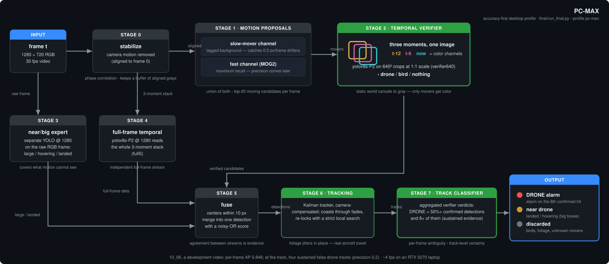
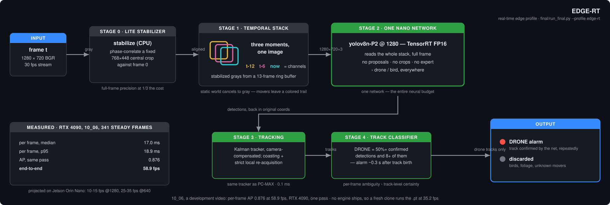

# Deliverable models — PC-MAX & EDGE-RT

*The two shipped profiles, in `final/`. For the full project overview see the [main README](../README.md); for the design story see [round-3 report](../docs/reports/round3-deliverables.md).*

Both models are trained on **all 548 labeled frames of `data/videos/07_05.mp4`** (the split-trained
ablation generation behind the numbers in `docs/reports/round3-deliverables.md` §5 survives as its
evaluation tables — [`work/eval_round3_0705val.md`](../work/eval_round3_0705val.md),
[`_0705full`](../work/eval_round3_0705full.md), [`_1006test`](../work/eval_round3_1006test.md), and
for the edge lineup [`realtime/work/eval3_0705_val.md`](../realtime/work/eval3_0705_val.md) /
[`eval3_1006_test.md`](../realtime/work/eval3_1006_test.md) — not as run directories: `work/runs/`
is training output and is not tracked).
`data/videos/10_06.mp4` was never trained on — it is the test video — but six track-classifier constants were hand-set against it, so it is a development set rather than an unseen one.

> **Full-length test video.** The source files hide their opening seconds behind an MP4
> edit list (`tools/recover_full_video.py` recovers them losslessly — `data/videos/10_06.mp4` is really
> 591 frames / 19.7 s, not 361 / 12 s). Both profiles were re-run end-to-end on the
> recovered full video: tracked AP/F1 = 1.000 holds on the labeled range — score-weighted per
> frame; at the track PC-MAX raises four sustained false drone tracks on this video (README §7) —
> and PC-MAX additionally finds + confirms the drone's earlier *exit pass*
> in the pre-roll (drone track, frames 14–86; it re-enters at the same spot 7 s later as
> the known flight). Annotated full-length videos: [PC-MAX](../docs/media/10_06_pcmax_tracks.mp4) ·
> [EDGE-RT](../docs/media/10_06_edgert_tracks.mp4) ·
> [side-by-side vs baseline](../docs/media/10_06_baseline_vs_pcmax_vs_edgert.mp4).

## 1. PC-MAX — most powerful, desktop GPU

Architecture (see `docs/reports/round3-deliverables.md`): three complementary detection streams fused, then
temporal integration —

<p align="center">
  
</p>

- shipped-package score on `10_06`, a development video: tracked AP/F1 = 1.000 score-weighted
  per frame (per-frame AP 0.846) — at the track it raises four sustained false drone tracks
  (README §7); drone confirmed 7 frames after track birth;
  also reports the landed drone as a separate `near` track. ~4 fps on an RTX 5070 laptop.
  (Split-trained generation for honest-ablation numbers: `docs/reports/round3-deliverables.md` §5 — same 1.000
  tracked, per-frame 0.910.)
- final weights: `pc_max/fullS.pt` (`final-ftS-s1280`), `pc_max/verifier640.pt`
  (`final-ft7-s640`), `pc_max/expert1280.pt` (round-1 ft1, unchanged)

## 2. EDGE-RT — real-time, edge hardware

One nano network on the 3-frame stabilized stack — no proposal stage, no expert:

<p align="center">
  
</p>

- shipped-package score on `10_06`, a development video: tracked AP/F1 = 1.000 score-weighted
  per frame (per-frame AP 0.876) — not a track-level false-alarm count; drone confirmed 10
  frames after track birth. Re-measured on an RTX 4090 with a rebuilt engine, in the same pass as
  the accuracy: **58.9 fps at AP 0.876** (README §8). The rest of this paragraph is the round-3
  measurement on an RTX 5070 Laptop, which has not been reproduced:
  **~74 fps** through `run_final.py` on an RTX 5070 Laptop
  (13.5 ms/frame, `docs/reports/round3-deliverables.md` §6), and 84.8 fps for the lean
  `realtime` runner it wraps — that one is 11.8 ms of wall clock against 9.5 ms of
  pipeline stage time (detector NN 5.3, stabilize+warp 4.1, tracker 0.1;
  `realtime/work/bench3.md`). Two runners over the same network, measured separately;
  quote whichever you actually ran.
  Both rates are TensorRT FP16 and neither applies until an engine exists (below).
  Projected 10–15 fps FP16 on Jetson Orin Nano @1280; INT8 was net-negative on
  desktop — recalibrate on Orin before trusting it. Split-trained generation:
  tracked **0.995** val / 1.000 test causally (1.000 val / 0.996 full with the offline
  coast-smoothing pass, which is a surveillance-mode artifact and not a live output),
  per-frame 0.717 val / 0.889 test.
- final weights: `edge_rt/edge_n1280.pt` (`final-ftC-n1280-e25`) and a portable
  `edge_n1280.onnx` / `edge_n1280.fp16.onnx`. **The TensorRT engine is not shipped.**
  An engine is compiled for one GPU architecture and one TensorRT build, so `*.engine`
  is gitignored and a fresh clone contains none — build it on the machine you intend to
  run on, before quoting either rate above:

  ```bash
  .venv/bin/pip install tensorrt   # not in requirements.txt; nothing else needs it
  .venv/bin/python -c "from ultralytics import YOLO; \
      YOLO('final/edge_rt/edge_n1280.pt').export(format='engine', half=True, imgsz=1280, batch=1, device=0)"
  ```

  which leaves `edge_rt/edge_n1280.engine` next to the weights, exactly where
  `run_final.py` looks for it. Without it the runner falls back to the `.pt` and says
  nothing about it — re-running the `--profile edge-rt` command below on `10_06.mp4`
  with no engine on disk gives the same single confirmed drone track over frames
  23–360 and the same 10-frame alarm latency, at **48–53 fps** (four runs on this
  machine: 16.1–17.7 ms/frame, of which the detector NN is ~10 ms and stabilize+warp
  ~7). Every run writes its own rate to `meta.fps_end_to_end` in `dets.json`, so this
  is one command to check rather than a number to take on trust — and the spread is
  why it is quoted as a range. So the engine buys roughly 1.5x here: worth building,
  but the fallback is a working real-time detector, not a broken one. The Orin figure
  above is an FP16-engine projection, which assumes one gets built there too.
  (`realtime/tools/export_models.py` is the batch equivalent for the six-pipeline
  `realtime` lineup, built from its own round-2 run directories; it does not produce
  this file.)

## Run either model on any video

```bash
.venv/bin/python final/run_final.py --video path/to/video.mp4 --profile pc-max  --out out_pc
.venv/bin/python final/run_final.py --video path/to/video.mp4 --profile edge-rt --out out_edge
```

Outputs: `dets.json` (per-frame, original coords, fps + stage timings in `meta`),
`tracks.json` / `tracks_drone.json` (all / classified-drone tracks),
`tracked_dets.json` (track-integrated detections, coast-smoothed),
`alarms.txt` (per drone track: span, coverage, confirmation frame + latency),
`annotated.mp4` (classified tracks painted).

Alarm semantics: a track is announced as a drone once it accumulates 8
verifier-confirmed detections (`dronedet/trackclass.py`); measured confirmation
latency from track birth is 7 frames for PC-MAX and 10 frames for EDGE-RT
(~0.25–0.35 s at 30 fps).

## Retraining for a new deployment

```bash
.venv/bin/python tools/label.py                     # hand-label a short clip
.venv/bin/python tools/build_gt_user.py             # labels -> gt_user.json
.venv/bin/python tools/make_datasets_v3.py --split-at <n_frames> --suffix _all
# edge net: yolov8n-p2 @1280 on dsv3_full_temporal_all; PC nets: see tools/final_round3.py
```
